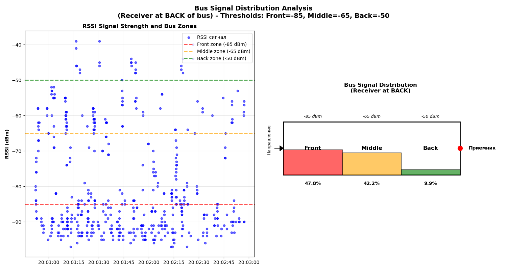
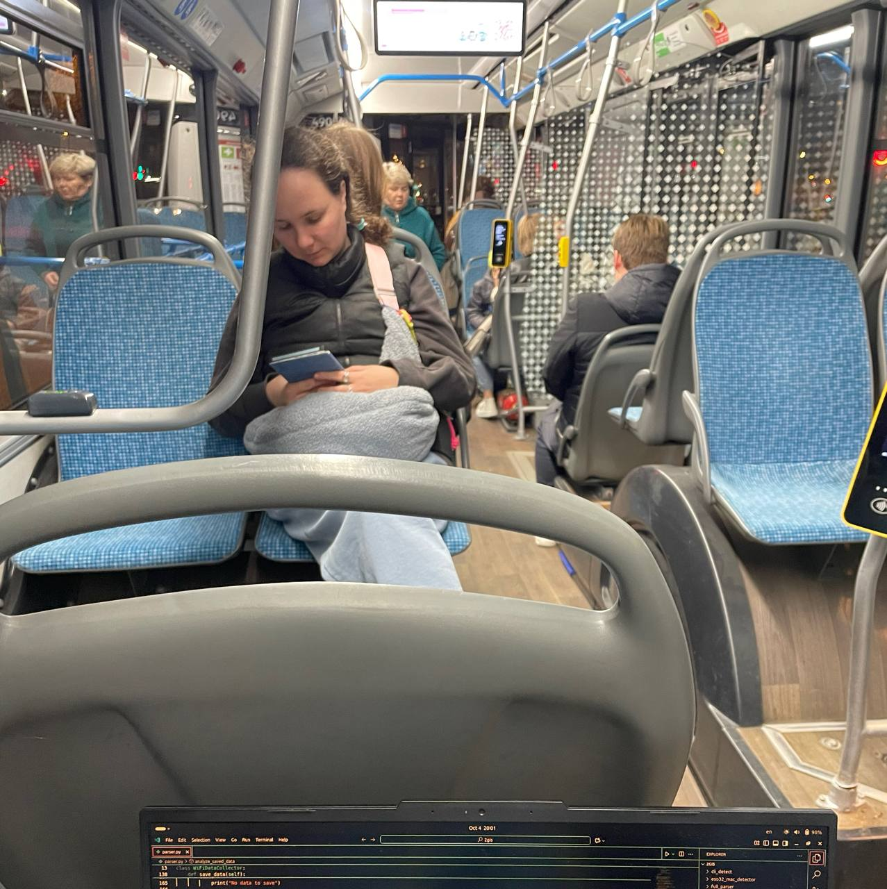

# Transportation Analysis System

## 🚌 Обзор системы

**Transportation Analysis System** - это комплексная система анализа городского транспорта, объединяющая мониторинг распределения пассажиров в автобусах и интеллектуальную обработку данных с использованием микросервисной архитектуры.

### 🎯 Основные возможности

- **📡 Мониторинг в реальном времени** - сбор и анализ WiFi сигналов для определения распределения пассажиров
- **🤖 Интеллектуальный анализ** - использование языковых моделей для обработки данных
- **👥 Анализ толпы** - оценка заполненности и распределения людей в транспорте
- **📊 Визуализация данных** - графики, схемы и аналитические отчеты
- **💾 Экспорт данных** - сохранение результатов в различных форматах

## 🏗️ Архитектура системы

Проект состоит из трех основных сервисов:

### 🔧 Основные сервисы

- **🚀 LLM Service** (порт 1337) - сервис для работы с языковыми моделями
- **📊 Crowd Analysis Service** (порт 1338) - сервис анализа толпы
- **📡 Bus Signal Analyzer** - система мониторинга распределения в автобусах

### Общая архитектура

```
┌─────────────────┐    Serial/USB    ┌──────────────────┐    HTTP/REST    ┌──────────────────┐
│   ESP32 Module  │◄────────────────►│   Python Analyzer│◄───────────────►│  Microservices   │
│                 │                  │                  │                 │                  │
│  - WiFi Scanner │                  │  - Data Processor│                 │  - LLM Service   │
│  - RSSI Collector│                 │  - Visualization │                 │  - Crowd Analysis│
└─────────────────┘                  │  - CSV Export    │                 └──────────────────┘
                                     └──────────────────┘
                                              │
                                     ┌────────▼────────┐
                                     │   Results       │
                                     │   Directory     │
                                     └─────────────────┘
```

## 🚀 Быстрый старт

### 1. Клонирование репозитория
```bash
git clone <repository-url>
cd template
```

### 2. Запуск с Docker Compose
```bash
# Запуск всех сервисов
docker-compose up --build -d
```

```bash
# Просмотр логов
docker-compose logs -f
```

```bash
# Остановка сервисов
docker-compose down
```

### 3. Настройка переменных окружения

В docker compose необходимо указать ссылку на провайдера и ключ API:

```yaml
environment:
  - OPENAI_API_KEY=${OPENAI_API_KEY:-<YOUR KEY HERE>}
  - OPENAI_BASE_URL=${OPENAI_BASE_URL:-<OPENROUTER || PROXYAPI>}
```

### 4. Проверка работы

После запуска откройте [prototype.html](./prototype.html) для тестирования функционала. Примеры данных находятся в папке [data](./data/).

## 📡 Bus Signal Distribution Analyzer

### Технология работы

#### 📡 Сбор данных (ESP32)
ESP32 работает как WiFi сканер:
- Сканирует окружающие WiFi устройства
- Измеряет RSSI (силу сигнала) для каждого обнаруженного устройства
- Отправляет данные в формате: `timestamp,rssi` или `rssi`
- RSSI значения варьируются от -30 dBm (близко) до -100 dBm (далеко)

#### 🎯 Алгоритм анализа распределения

**Классификация зон автобуса:**
```python
location_thresholds = {
    'back': -50,    # Задняя часть - сильные сигналы
    'middle': -65,  # Средняя часть - средние сигналы  
    'front': -85    # Передняя часть - слабые сигналы
}
```

**Логика определения местоположения:**
```python
def get_location(rssi):
    if rssi > -50:    return 2, 'Back'    # Близко к приемнику
    elif rssi > -65:  return 1, 'Middle'  # Среднее расстояние
    elif rssi > -85:  return 0, 'Front'   # Далеко от приемника
    else:             return -1, 'Noise'  # Слишком слабый сигнал
```

### ⚙️ Установка и запуск анализатора

#### Предварительные требования:
- Python 3.8 или новее
- pip (менеджер пакетов Python)
- Доступ к порту USB для подключения ESP32

#### Установка зависимостей:
```bash
pip install pandas numpy matplotlib pyserial
```

#### Запуск системы:
```bash
python bus_analyzer.py
```

### 📊 Формат данных ESP32

**Основной формат:**
```
timestamp,rssi
```
**Пример:**
```
123456789,-65
123456790,-72
123456791,-58
```

**Упрощенный формат:**
```
rssi
```
**Пример:**
```
-65
-72
-58
```

## 🔌 API Endpoints

После запуска сервисы будут доступны по следующим адресам:

- **🔮 LLM Service**: http://localhost:1337
- **👥 Crowd Analysis Service**: http://localhost:1338

## 🛠️ Разработка

### Пересборка образов

```bash
# Пересборка всех образов
docker-compose build

# Пересборка конкретного сервиса
docker-compose build llm-service
```

### Просмотр состояния

```bash
# Статус контейнеров
docker-compose ps

# Логи конкретного сервиса
docker-compose logs llm-service

# Подключение к контейнеру
docker-compose exec llm-service sh
```

## 📁 Структура проекта

```
template/
├── docker-compose.yaml          # Конфигурация Docker Compose
├── data/                        # Статические файлы данных
├── src/services/
│   ├── llm_service/            # 🔮 LLM сервис
│   ├── crowd_analysis_service/ # 👥 Сервис анализа толпы
│   └── bus_analyzer/           # 📡 Анализатор автобусных сигналов
├── prototype.html              # 🎯 Веб-интерфейс
└── README.md                   # 📚 Документация
```

## 🧮 Алгоритм анализа сигналов

### 1. Предобработка данных
```python
def filter_short_stops(df, min_stop_duration=1):
    # Фильтрует короткие остановки (< 1 минуты)
    # Игнорирует данные с движущегося автобуса
```

### 2. Классификация сигналов
- **🔴 Back (Задняя)**: RSSI > -50 dBm
- **🟡 Middle (Средняя)**: -65 ≤ RSSI < -50 dBm  
- **🟢 Front (Передняя)**: -85 ≤ RSSI < -65 dBm
- **⚫ Noise (Шум)**: RSSI < -85 dBm

### 3. Статистический анализ
```python
def generate_summary(df, cycle_count):
    # Расчет процентов распределения по зонам
    # Определение преобладающей зоны
    # Генерация текстового отчета
```

## 📊 Примеры использования

### Типичный рабочий цикл:
```
Цикл анализа #1
==================================================
Подключено к /dev/ttyUSB0
Начат сбор данных на 2 минут...
Сбор данных завершен. Собрано 847 измерений

АНАЛИЗ РАСПРЕДЕЛЕНИЯ СИГНАЛОВ В АВТОБУСЕ
============================================
Период анализа: 2.0 минут
Всего измерений RSSI: 723
Средний RSSI: -68.5 dBm

--- РАСПРЕДЕЛЕНИЕ СИГНАЛОВ ПО ЗОНАМ ---
Front:    110 измерений (15.2%) 🟢
Middle:   331 измерений (45.8%) 🟡  
Back:     282 измерений (39.0%) 🔴

ПРЕОБЛАДАЮЩИЙ СИГНАЛ: СМЕШАННОЕ
```

## 🐛 Troubleshooting

### Проверка здоровья сервисов
```bash
# Проверка статуса
docker-compose ps

# Проверка логов
docker-compose logs

# Перезапуск сервиса
docker-compose restart llm-service
```

### Распространенные проблемы:

**Нет подключения к ESP32:**
```
Ошибка подключения к /dev/ttyUSB0: [Errno 2] No such file or directory
```
**Решение**: Проверьте физическое подключение и права доступа к порту

**Нет данных от ESP32:**
```
Данные не получены. Пропускаем цикл.
```
**Решение**: Проверьте формат данных и скорость передачи (baudrate=115200)

### Очистка
```bash
# Остановка и удаление контейнеров
docker-compose down

# Удаление с очисткой volumes
docker-compose down -v

# Удаление образов
docker-compose down --rmi all
```

## 📈 Результаты и визуализация

Система генерирует comprehensive отчеты и визуализации:

- **📊 Графики распределения** RSSI сигналов с порогами зон
- **🚌 Схемы автобуса** с визуализацией заполненности зон
- **📈 Динамика устройств** в минуту
- **📋 Текстовые отчеты** с детальной статистикой

### Пример визуализации:


### Схема автобуса:


## 🔮 Дальнейшее развитие

### Возможные улучшения:
- **🧠 Машинное обучение** для более точной классификации
- **🌐 Веб-интерфейс** для удаленного мониторинга
- **📱 Мобильное приложение** для оперативного просмотра
- **🎯 Интеграция с GPS** для привязки к остановкам
- **🔢 Мульти-ESP32 система** для повышения точности

---

## 🚀 Система готова к использованию!

Для начала работы:
1. Запустите микросервисы: `docker-compose up --build -d`
2. Подключите ESP32 и запустите анализатор: `python pars_vis.py`
3. Откройте веб-интерфейс: `prototype.html`

Наслаждайтесь комплексным анализом городского транспорта! 🎉