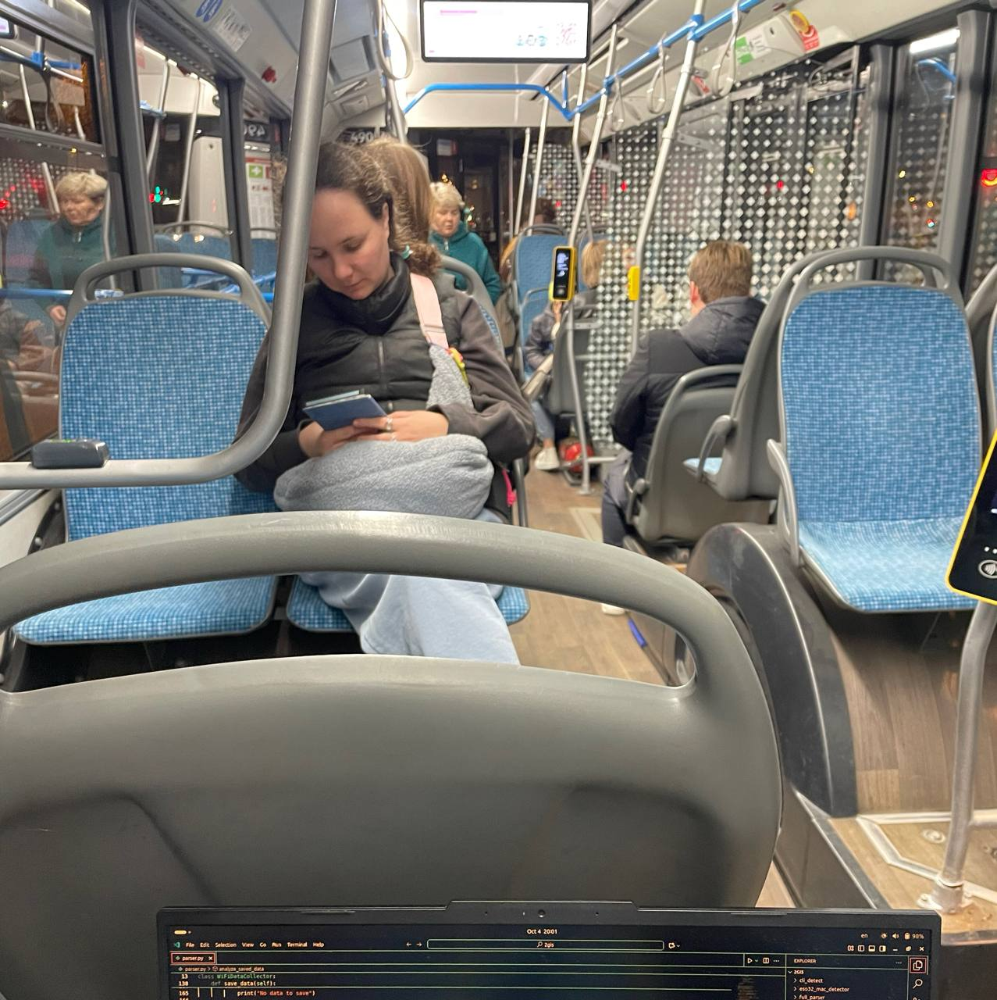

# Bus Signal Distribution Analyzer

## 📋 Оглавление
- [Обзор системы](#обзор-системы)
- [Архитектура системы](#архитектура-системы)
- [Технология работы](#технология-работы)
- [Требования к оборудованию](#требования-к-оборудованию)
- [Установка и запуск](#установка-и-запуск)
- [Формат данных ESP32](#формат-данных-esp32)
- [Алгоритм анализа](#алгоритм-анализа)
- [Структура проекта](#структура-проекта)
- [Примеры использования](#примеры-использования)

## 🚌 Обзор системы

**Bus Signal Distribution Analyzer** - это интеллектуальная система для анализа распределения WiFi сигналов в автобусе в реальном времени на основе измерения RSSI (Received Signal Strength Indicator). Система определяет распределение беспроводных устройств по зонам автобуса и предоставляет детальную аналитику.

### 🎯 Основные возможности
- 📡 **Реальный мониторинг** - сбор RSSI данных с ESP32 через COM-порт в реальном времени
- 📊 **Интеллектуальный анализ** - классификация сигналов по зонам автобуса
- 📈 **Визуализация данных** - графики распределения и статистика
- 💾 **Экспорт данных** - сохранение результатов в CSV формате
- 🔄 **Непрерывный анализ** - автоматические циклы сбора и обработки данных

## 🏗️ Архитектура системы

```
┌─────────────────┐    Serial/USB    ┌──────────────────┐
│   ESP32 Module  │◄────────────────►│   Python Analyzer│
│                 │                  │                  │
│  - WiFi Scanner │                  │  - Data Processor│
│  - RSSI Collector│                 │  - Visualization │
└─────────────────┘                  │  - CSV Export    │
                                     └──────────────────┘
                                              │
                                     ┌────────▼────────┐
                                     │   Results       │
                                     │   Directory     │
                                     └─────────────────┘
```

## 🔧 Технология работы

### 1. 📡 Сбор данных (ESP32)
ESP32 работает как WiFi сканер:
- Сканирует окружающие WiFi устройства
- Измеряет RSSI (силу сигнала) для каждого обнаруженного устройства
- Отправляет данные в формате: `timestamp,rssi` или `rssi`
- RSSI значения варьируются от -30 dBm (близко) до -100 dBm (далеко)

### 2. 🎯 Алгоритм анализа распределения

#### Классификация зон автобуса:
```python
location_thresholds = {
    'back': -50,    # Задняя часть - сильные сигналы (близко к приемнику)
    'middle': -65,  # Средняя часть - средние сигналы  
    'front': -85    # Передняя часть - слабые сигналы (далеко от приемника)
}
```

#### Логика определения местоположения:
```python
def get_location(rssi):
    if rssi > -50:    return 2, 'Back'    # Близко к приемнику (задняя часть)
    elif rssi > -65:  return 1, 'Middle'  # Среднее расстояние
    elif rssi > -85:  return 0, 'Front'   # Далеко от приемника (передняя часть)
    else:             return -1, 'Noise'  # Слишком слабый сигнал
```

### 3. 🧠 Интеллектуальный анализ

#### Группировка устройств:
```python
def group_similar_devices(df, rssi_threshold=5, time_window_seconds=2, max_packets=5):
    # Группирует похожие RSSI сигналы в временном окне
    # для подсчета уникальных устройств и фильтрации дубликатов
```

#### Фильтрация коротких остановок:
```python
def filter_short_stops(self, min_stop_duration=1):
    # Фильтрует данные с коротких остановок (< 1 минуты)
    # Оставляет только релевантные данные для анализа
```

## ⚙️ Установка и запуск

### Предварительные требования:
- Python 3.8 или новее
- pip (менеджер пакетов Python)
- Доступ к порту USB для подключения ESP32 (обычно `/dev/ttyUSB0` на Linux)

### Установка зависимостей:
```bash
pip install pandas numpy matplotlib pyserial
```

### Запуск системы:
```bash
python bus_analyzer.py
```

### Зависимости Python:
```txt
pandas>=1.5.0      # Анализ данных и обработка
numpy>=1.21.0      # Математические операции
matplotlib>=3.5.0  # Визуализация графиков
pyserial>=3.5      # Коммуникация с ESP32
```

## 📡 Формат данных ESP32

### Основной формат (рекомендуется):
```
timestamp,rssi
```
**Пример:**
```
123456789,-65
123456790,-72
123456791,-58
```

### Упрощенный формат:
```
rssi
```
**Пример:**
```
-65
-72
-58
```

### Требования к данным:
- **Timestamp**: миллисекунды с начала работы ESP32 (опционально)
- **RSSI**: целое число от -30 до -100
- **Разделитель**: запятая для timestamp формата
- **Кодировка**: UTF-8
- **Игнорируемые строки**: системные сообщения ESP32, ошибки WiFi

## 🧮 Алгоритм анализа

### 1. Предобработка данных
```python
def filter_short_stops(df, min_stop_duration=1):
    # Фильтрует короткие остановки (< 1 минуты)
    # Игнорирует данные с движущегося автобуса
    # Группирует данные по временным интервалам
```

### 2. Классификация сигналов
- **Back** (Задняя): RSSI > -50 dBm
- **Middle** (Средняя): -65 ≤ RSSI < -50 dBm  
- **Front** (Передняя): -85 ≤ RSSI < -65 dBm
- **Noise** (Шум): RSSI < -85 dBm

### 3. Статистический анализ
```python
def generate_summary(df, cycle_count):
    # Расчет процентов распределения по зонам
    # Определение преобладающей зоны
    # Генерация текстового отчета
    # Анализ качества данных
```

### 4. Визуализация результатов
- **График распределения**: RSSI сигналы с порогами зон
- **Схема автобуса**: визуализация заполненности зон
- **График устройств в минуту**: динамика количества устройств

## 📊 Класс BusDistributionAnalyzer

### Основные методы:
- `__init__(com_port, baudrate, output_dir)` - инициализация параметров системы
- `start_data_collection(collection_minutes)` - начало сбора данных с ESP32
- `run_continuous_analysis(collection_minutes, cycles)` - основной цикл работы
- `calculate_distribution(df)` - классификация сигналов по зонам
- `plot_distribution_analysis(df, cycle_count)` - визуализация результатов

### Вспомогательные методы:
- `connect_serial()` - подключение к ESP32
- `filter_short_stops()` - фильтрация данных
- `group_similar_devices()` - группировка уникальных устройств
- `generate_summary()` - генерация отчета
- `save_data_to_csv()` - экспорт данных в CSV

### Параметры конфигурации:
```python
# Порт подключения ESP32
com_port = '/dev/ttyUSB0'

# Скорость передачи данных
baudrate = 115200

# Директория для результатов
output_dir = 'results'

# Длительность сбора данных (минуты)
collection_minutes = 2

# Пороги классификации RSSI
location_thresholds = {
    'back': -50,
    'middle': -65, 
    'front': -85
}
```

## 🚀 Примеры использования

### Типичный рабочий цикл:
```
Цикл анализа #1
--------------------------------------------------
Подключено к /dev/ttyUSB0
Начат сбор данных на 2 минут...
Сбор данных завершен. Собрано 847 измерений
Фильтрация коротких остановок (< 1 мин)...
Данные сохранены в таблицу: results/collected_data_cycle_1.csv
Статистика сохранена: results/summary_stats_cycle_1.csv

============================================================
АНАЛИЗ РАСПРЕДЕЛЕНИЯ СИГНАЛОВ В АВТОБУСЕ
============================================================
Период анализа: 2.0 минут
Всего измерений RSSI: 723
Средний RSSI: -68.5 dBm
Используемые пороги: Front=-85, Middle=-65, Back=-50

--- РАСПРЕДЕЛЕНИЕ СИГНАЛОВ ПО ЗОНАМ ---
Всего валидных сигналов: 723
Шум/потери: 124
Front :   110 измерений ( 15.2%)
Middle:   331 измерений ( 45.8%)
Back  :   282 измерений ( 39.0%)

ПРЕОБЛАДАЮЩИЙ СИГНАЛ: СМЕШАННОЕ

Группировка пакетов по устройствам...
Всего пакетов: 723
Уникальных устройств: 156
График сохранен: results/distribution_analysis_cycle_1.png
График сохранен: results/devices_per_minute_cycle_1.png
```

### Генерируемые файлы:
- `collected_data_cycle_N.csv` - сырые данные измерений
- `summary_stats_cycle_N.csv` - статистика по циклу
- `distribution_analysis_cycle_N.png` - график распределения
- `devices_per_minute_cycle_N.png` - динамика устройств

## 🔧 Настройка и калибровка

### Настройка порогов RSSI:
```python
# В классе BusDistributionAnalyzer
self.location_thresholds = {
    'back': -50,    # Настройте под ваш автобус
    'middle': -65,  # и расположение ESP32
    'front': -85
}
```

### Калибровка для разных сценариев:
1. **Маленький автобус**: уменьшите пороги на 5-10 dBm
2. **Большой автобус**: увеличьте пороги на 5-10 dBm  
3. **Разное расположение ESP32**: требуется экспериментальная калибровка
4. **Городская среда**: могут потребоваться более строгие пороги из-за интерференции

### Настройка временных параметров:
```python
# Длительность сбора данных (минуты)
collection_minutes = 2

# Минимальная длительность остановки (минуты)  
min_stop_duration = 1

# Окно группировки устройств (секунды)
time_window_seconds = 2

# Порог RSSI для группировки (dBm)
rssi_threshold = 5
```

## 🐛 Устранение неполадок

### Распространенные проблемы:

#### 1. Нет подключения к ESP32:
```
Ошибка подключения к /dev/ttyUSB0: [Errno 2] No such file or directory
```
**Решение**: 
- Проверьте физическое подключение ESP32
- Убедитесь что порт правильный (`/dev/ttyUSB0` на Linux, `COM3` на Windows)
- Проверьте права доступа к порту

#### 2. Нет данных от ESP32:
```
Данные не получены. Пропускаем цикл.
```
**Решение**: 
- Проверьте формат данных ESP32
- Убедитесь что ESP32 отправляет данные
- Проверьте скорость передачи (baudrate=115200)

#### 3. Много шумовых сигналов:
```
Шум/потери: 856
```
**Решение**: Настройте пороги RSSI в `location_thresholds`

#### 4. Ошибки декодирования данных:
```
Ошибка чтения данных: ...
```
**Решение**: Проверьте целостность данных и кодировку

## 📊 Интерпретация результатов

### Проценты распределения:
- **Front (Передняя)**: 0-30% - мало устройств в передней части
- **Middle (Средняя)**: 30-60% - среднее распределение  
- **Back (Задняя)**: 60-100% - концентрация устройств в задней части

### Качество данных:
- **Валидные сигналы**: RSSI в диапазоне -85 до -50 dBm
- **Шум**: RSSI < -85 dBm (игнорируется в анализе)
- **Рекомендация**: минимум 50-100 валидных сигналов для достоверного анализа

### Преобладающие сценарии:
- **Задняя часть доминирует**: >60% сигналов в Back зоне
- **Передняя часть доминирует**: >60% сигналов в Front зоне  
- **Смешанное распределение**: равномерное распределение между зонами

## Результаты
Было получено следующее распределение:

Для автобуса:

## 🔮 Дальнейшее развитие

### Возможные улучшения:
- **Машинное обучение** для более точной классификации устройств
- **Многопоточная обработка** для улучшения производительности
- **Веб-интерфейс** для удаленного мониторинга
- **Интеграция с GPS** для привязки к конкретным остановкам
- **Исторический анализ** трендов распределения
- **Мульти-ESP32 система** для повышения точности и покрытия
- **Мобильное приложение** для оперативного просмотра результатов

### Оптимизации:
- **Адаптивные пороги** RSSI на основе исторических данных
- **Фильтрация помех** от стационарных WiFi точек доступа
- **Кластеризация устройств** по поведенческим паттернам
- **Прогнозирование** заполненности на основе временных рядов

---

**🚀 Система готова к использованию! Для начала работы подключите ESP32 и запустите `python pars_vis.py`**